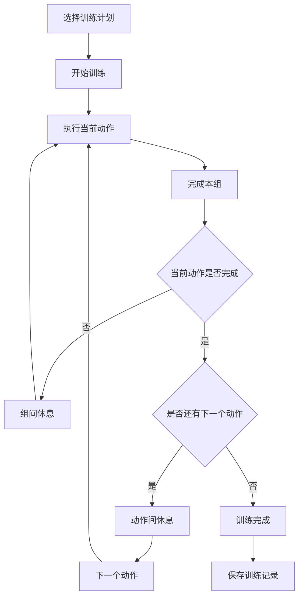

# 训练本（SetTrace）UI 设计规范与 Flutter 实现说明

> 用途：本文件作为 **Figma 设计稿 → Flutter/Codex 实现** 的统一规范。  
> 目标平台：**Android 16**  
> 产品中文名：**训练本**  
> 英文/代码项目名：**SetTrace**  
> 设计方向：**极简、扁平、工具型、轻量、训练场景优先**  
> 主题：**Light / Dark 双主题，共享同一套语义 Token 与组件结构**

---

## 1. 产品定位

训练本是一款轻量健身训练记录 App，重点解决训练过程中以下问题：

- 忘记当前做到了第几组
- 忘记下一个动作是什么
- 组间休息时间不统一
- 动作之间休息时间不好控制
- 训练结束后缺少简单的历史记录和统计

核心原则：

> **训练过程中尽量只需要做一个动作：点击「完成本组」。**

不把产品做成复杂健身平台，不做课程商城、社交、AI 教练等大而全功能。

---

# 2. 核心功能结构

## 2.1 训练计划

用户可以创建多个训练计划，例如：

- 练背
- 练胸
- 练腿
- Push
- Pull
- Legs
- 自定义训练

每个训练计划包含多个动作。

每个动作支持：

- 动作名称
- 动作顺序
- 组数
- 组间休息时间
- 动作结束后的休息时间
- 重量（可选）
- 备注（可选）

---

## 2.2 动作参数

示例：

```text
动作：坐姿划船
组数：4 组
组间休息：2.0 min
动作结束后休息：2.5 min
重量：45 kg
```

规则：

```text
组数步进：1
休息时间步进：0.5 min
0.5 min = 30 秒
```

---

## 2.3 训练流程



---

# 3. 页面结构

当前 Figma 设计包含以下 7 个核心页面。

## 3.1 首页 / 训练计划

职责：

- 展示已有训练计划
- 快速开始训练
- 新建训练计划
- 进入训练记录

主要信息：

```text
训练计划

今天练什么？

练背
4 个动作 · 约 45 min

练胸
5 个动作

练腿
4 个动作
```

底部导航：

- 计划
- 记录
- 设置

---

### 首页计划导入导出

标题右侧保留“＋ 新建”，增加带语义标签“计划导入导出”的更多菜单，包含“导入计划”“导出计划”。没有计划时仍可导入，导出提示没有可导出的计划。

导出选择页默认全选，支持单选、多选、全选和取消全选，显示所选数量。底部提供“复制到剪贴板”和“导出到文件”；无选择或执行中不可提交。复制及保存结果显示在页内，避免遮住操作按钮。文件默认在公共下载目录，成功反馈显示实际文件名。界面说明备份包含计划配置。

导入页支持手动粘贴、主动点击“粘贴”和“从文件选择”，不自动读取剪贴板。校验后进入预览：可修改计划名称，显示动作数、总组数及可展开的完整动作配置。同名生成副本，取消不保存，确认成功返回首页并提示数量；错误保留预览可重试，保存中禁用重复提交。入口、按钮和主要操作遵守 48 dp，使用既有语义主题，支持 360–430 dp 及字体放大。

## 3.2 计划详情 / 动作排序

职责：

- 查看当前训练计划
- 添加动作
- 删除动作
- 修改动作
- 拖动调整动作顺序
- 开始训练

动作行示例：

```text
☰  高位下拉
   4 组 · 组间 2.0 min        >
```

动作顺序使用拖动排序。

---

## 3.3 编辑动作

字段：

- 动作名称
- 组数
- 组间休息
- 动作完成后休息
- 重量（可选）

其中：

- 组数使用拨片 / Picker
- 休息时间使用拨片 / Picker
- 不使用传统 `- / +` 按钮作为主要交互

---

## 3.4 训练准备

展示：

- 当前训练计划名称
- 动作总数
- 总组数
- 预计训练时长
- 动作顺序

底部主按钮：

```text
开始训练
```

---

## 3.5 训练进行中

这是整个 App 最重要的页面。

必须突出：

- 当前训练计划
- 当前动作
- 当前重量
- 当前组数
- 总组数
- 当前动作完成状态
- 下一动作
- 完成本组按钮
- 撤销上一组

示例：

```text
练背
动作 2 / 4

坐姿划船
45 kg

03 / 04

● ● ○ ○

当前第 3 组

[ 完成本组 ]

下一动作
单臂哑铃划船 · 3 组
```

原则：

> **当前组数是整个页面的视觉中心。**

---

## 3.6 休息计时

页面核心：

```text
组间休息

01:47

下一组
坐姿划船 · 4 / 4

[-30 秒] [跳过] [+30 秒]
```

支持：

- -30 秒
- +30 秒
- 跳过
- 撤销上一组

倒计时结束后进入下一组或下一个动作。

---

## 3.7 历史记录 / 简单统计

第一版只提供简单统计：

- 训练日期
- 训练计划
- 训练时长
- 动作数量
- 总组数

示例：

```text
25
练背
51 min · 4 个动作 · 15 组
```

顶部可以显示当月：

- 训练次数
- 总训练时长
- 完成组数

---

# 4. 设计原则

## 4.1 视觉关键词

- 极简
- 扁平
- 清晰
- 高可读性
- 工具感
- 少装饰
- 少渐变
- 少阴影
- 大数字
- 强状态反馈

---

## 4.2 不采用固定 Material 3 外观

Flutter 可以使用：

```dart
ThemeData
```

作为主题基础设施，但：

> **不要求最终 UI 呈现 Material 3 / Pixel 风格。**

产品视觉由自己的 Design Token 控制。

禁止直接依赖某个系统 UI 风格。

---

# 5. Theme / Design Token

## 5.1 Light Theme

```text
canvas          #EEF2F4
background      #F6F7F8
surface         #FFFFFF
surfaceAlt      #EEF1F3
border          #D9DEE3

textPrimary     #161A1D
textSecondary   #66707A
textTertiary    #98A2AD

accent          #42D6A4
accentPressed   #24B986
accentSoft      #E8FBF4
onAccent        #0C1512

danger          #F06565
dangerSoft      #FFF0F0
```

用途：

| Token | 用途 |
|---|---|
| `canvas` | Figma 外围 / 页面外背景 |
| `background` | App 页面背景 |
| `surface` | 卡片 |
| `surfaceAlt` | 次级按钮、输入区域 |
| `border` | 卡片边框、分割线 |
| `textPrimary` | 主文字 |
| `textSecondary` | 描述文字 |
| `textTertiary` | 弱提示 |
| `accent` | 品牌主色、主按钮 |
| `accentPressed` | 按压、进度条 |
| `accentSoft` | 选中态浅背景 |
| `onAccent` | Accent 上的文字 |
| `danger` | 删除、危险操作 |

---

## 5.2 Dark Theme

```text
canvas          #0B0D0E
background      #111315
surface         #1B1E21
surfaceAlt      #24282C
border          #30353A

textPrimary     #F5F6F7
textSecondary   #9CA3A9
textTertiary    #596068

accent          #42D6A4
accentPressed   #24B986
accentSoft      #17221F
onAccent        #0C1512

danger          #FF6868
dangerSoft      #2A1719
```

---

# 6. Token 使用原则

业务代码禁止直接写 Hex：

错误：

```dart
Container(
  color: const Color(0xFFF6F7F8),
)
```

正确思路：

```dart
Container(
  color: context.appColors.background,
)
```

建议使用 Flutter `ThemeExtension`：

```dart
class AppColors extends ThemeExtension<AppColors> {
  final Color background;
  final Color surface;
  final Color surfaceAlt;
  final Color border;

  final Color textPrimary;
  final Color textSecondary;
  final Color textTertiary;

  final Color accent;
  final Color accentPressed;
  final Color accentSoft;
  final Color onAccent;

  final Color danger;
  final Color dangerSoft;
}
```

---

# 7. Flutter Theme 推荐结构

```text
lib/
└─ app/
   └─ theme/
      ├─ app_theme.dart
      ├─ app_colors.dart
      ├─ app_spacing.dart
      ├─ app_radius.dart
      ├─ app_typography.dart
      └─ app_duration.dart
```

建议：

```text
AppTheme
├─ lightTheme
├─ darkTheme
│
├─ AppColors
├─ AppSpacing
├─ AppRadius
├─ AppTypography
└─ AppDuration
```

ThemeData 负责：

- brightness
- 系统状态栏
- Android 系统主题适配
- 基础文本主题
- Flutter 控件基础配置

AppColors / Token 负责：

- 产品实际视觉

---

# 8. Spacing Token

只使用有限的间距等级：

```text
space1 = 4
space2 = 8
space3 = 12
space4 = 16
space5 = 20
space6 = 24
space8 = 32
```

推荐使用频率：

```text
8
12
16
24
```

尽量不要出现：

```text
13
17
19
23
```

等无统一规则的间距。

---

# 9. Radius Token

```text
radiusSm     = 10
radiusMd     = 12
radiusLg     = 14
radiusXl     = 16
radiusScreen = 30
```

建议：

```text
小控件       10
输入框       12
按钮         14
卡片         16
```

`radiusScreen` 只用于设计稿手机外框，正式 App 不需要。

---

# 10. Typography

字体策略：

```text
Android 系统字体优先
Fallback：Noto Sans SC
```

不要引入复杂字体包。

字号：

| Token | Size | Weight |
|---|---:|---|
| `displayTimer` | 64–72 | Bold |
| `displaySet` | 48–56 | Bold |
| `pageTitle` | 26–28 | Bold |
| `cardTitle` | 20–24 | Bold |
| `bodyLarge` | 16 | Regular |
| `body` | 14 | Regular |
| `caption` | 11–13 | Regular |

最重要的两个文本：

```text
03 / 04
01:47
```

它们是训练页面视觉中心。

---

# 11. Component Sizing

```text
Primary Button Height      54–58
Secondary Button Height    48–54
Input Height               50
Picker Height              52
Bottom Navigation Height   58
Minimum Touch Target       48
```

原则：

> 健身过程中操作必须容易点击。

不要设计过小按钮。

---

# 12. Button

## 12.1 Primary

用途：

- 开始训练
- 保存动作
- 完成本组
- 跳过

Light / Dark：

```text
background = accent
text       = onAccent
radius     = 14
```

---

## 12.2 Secondary

用途：

- 编辑计划
- 撤销上一组
- ±30 秒

```text
background = surfaceAlt
text       = textPrimary
border     = border
radius     = 14
```

---

## 12.3 Danger

用途：

- 删除动作
- 删除计划

```text
text       = danger
background = dangerSoft（需要强调时）
```

---

# 13. Card

## Light

```text
background = surface
border     = border
radius     = 16
```

可以使用极轻阴影：

```text
0 2 8 rgba(17, 24, 39, 0.04)
```

不要使用明显悬浮阴影。

## Dark

```text
background = surface
border     = border
radius     = 16
```

Dark 模式一般不需要阴影。

---

# 14. Picker / 拨片

## 14.1 结构

```text
3 组    [4 组]    5 组
```

```text
1.5 min    [2.0 min]    2.5 min
```

中间为当前值。

左右显示相邻值。

---

## 14.2 规则

组数：

```text
step = 1
```

休息：

```text
step = 0.5 min
```

---

## 14.3 Light

容器：

```text
background = #F1F4F6
border     = border
```

Selected：

```text
background = accent
text       = onAccent
```

Neighbor：

```text
background = surfaceAlt
text       = textSecondary
```

---

## 14.4 Dark

Selected：

```text
background = accent
text       = onAccent
```

Neighbor：

```text
background = surfaceAlt
text       = textSecondary
```

---

# 15. Picker Haptic

这是明确需求。

每跨一个有效档位：

```dart
HapticFeedback.selectionClick();
```

例如：

```text
1.5 → 2.0
```

触发一次。

```text
2.0 → 2.5
```

再触发一次。

禁止：

- 手指拖动过程中连续震动
- 强震
- 重反馈

目标是类似系统拨轮：

> **轻微“咔哒”感。**

---

# 16. 训练页状态颜色

Accent 不应该大量铺满页面。

使用位置：

- 当前组数
- 当前完成圆点
- 进度条
- Primary Button
- Picker Selected
- 当前训练状态

其他大多数 UI：

- 黑
- 白
- 灰

原则：

> **平时安静，训练时突出。**

---

# 17. Set Dots

示例：

```text
● ● ○ ○
```

完成：

```text
accent / accentPressed
```

未完成：

```text
textTertiary
```

避免使用红绿等过多颜色。

---

# 18. Progress Bar

Light：

```text
track = #E5E9EC
fill  = accentPressed
```

Dark：

```text
track = surfaceAlt
fill  = accent
```

高度：

```text
6–8 px
```

---

# 19. Rest Timer

倒计时：

```text
01:47
```

建议：

```text
fontSize 64–72
fontWeight Bold
color accent / accentPressed
```

倒计时必须成为休息页面视觉中心。

---

# 20. Bottom Navigation

三个 Tab：

```text
计划
记录
设置
```

## Light

整体：

```text
background = surface
border     = border
```

Selected：

```text
background = accentSoft
text       = accentPressed
```

Unselected：

```text
text = textSecondary
```

## Dark

Selected：

```text
background = accentSoft
text       = accent
```

---

# 21. Motion

动画必须克制。

```text
durationFast   = 150 ms
durationNormal = 200 ms
durationSlow   = 220 ms

curve = easeOut
```

适合动画：

- Picker Snap
- 进度条
- 完成一组
- 页面切换
- 倒计时完成
- Tab 选择

避免：

- 大幅弹跳
- 大缩放
- 长动画
- 花哨转场

---

# 22. Haptic

建议使用：

```dart
HapticFeedback.selectionClick()
```

场景：

- Picker 换档
- 完成一组（可选轻反馈）
- 倒计时结束（可比 selection 稍强）
- 关键确认

不要所有按钮都震动。

---

# 23. 倒计时实现规范

倒计时不要采用：

```text
remaining -= 1
```

作为唯一时间来源。

应该记录：

```text
restStartAt
restEndAt
```

界面剩余时间：

```text
remaining = restEndAt - now
```

这样即使：

- App 进入后台
- 锁屏
- Android 暂停进程
- 用户切到微信
- 国产手机进行后台限制

重新打开后仍然能计算正确时间。

---

# 24. 本地通知

训练休息结束时可以使用 Android 本地通知。

示例：

```text
休息结束
开始坐姿划船 · 第 4 组
```

通知属于增强功能。

第一版优先保证：

```text
App 前台计时正确
```

之后再增强后台通知体验。

---

# 25. App 状态恢复

训练进行中必须保存：

```text
sessionId
planId
currentExerciseIndex
currentSet
completedSets
startedAt
restEndAt
status
```

退出后再次进入：

```text
练背训练尚未完成

坐姿划船
3 / 4

[继续训练]
```

---

# 26. 数据模型建议

示意：

```dart
class WorkoutPlan {
  final String id;
  final String name;
  final List<ExerciseConfig> exercises;
}
```

```dart
class ExerciseConfig {
  final String id;
  final String name;

  final int sets;

  // 秒
  final int restBetweenSets;

  // 秒
  final int restAfterExercise;

  final double? weight;
  final String? note;
  final int sortOrder;
}
```

```dart
class WorkoutSession {
  final String id;
  final String planId;

  final DateTime startedAt;
  final DateTime? finishedAt;

  final int currentExerciseIndex;
  final int currentSet;

  final DateTime? restEndAt;
}
```

---

# 27. 时间内部统一使用秒

UI：

```text
2.0 min
```

数据库：

```text
120
```

UI：

```text
2.5 min
```

数据库：

```text
150
```

不要在数据库中使用 `2.5` 这样的分钟浮点数。

---

# 28. 建议项目结构

```text
lib/
├─ app/
│  ├─ app.dart
│  ├─ router/
│  └─ theme/
│
├─ core/
│  ├─ database/
│  ├─ utils/
│  └─ widgets/
│
├─ features/
│  ├─ plans/
│  ├─ workout/
│  ├─ history/
│  └─ settings/
│
└─ main.dart
```

不要一开始做过度复杂的 Clean Architecture。

目标：

> 清晰、容易维护、适合小型项目。

---

# 29. 建议基础组件

Codex 优先创建这些组件：

```text
AppPrimaryButton
AppSecondaryButton
AppCard
AppPicker
AppBottomNav
ExerciseCard
PlanCard
ProgressBar
SetProgressIndicator
WorkoutTimer
```

不要每个页面单独重复写 UI。

---

# 30. 主题切换

设置支持：

```text
跟随系统
浅色
深色
```

建议枚举：

```dart
enum AppThemeMode {
  system,
  light,
  dark,
}
```

默认：

```text
system
```

---

# 31. Android 16 适配

目标 Android 16。

需要注意：

- Edge-to-edge
- Status Bar
- Navigation Bar
- SafeArea
- 系统字体缩放
- 返回手势
- 深浅主题

不要为 Pixel 单独设计。

目标：

> 国产 Android 手机同样正常显示。

---

# 32. 响应式范围

首版主要针对手机竖屏。

设计基准：

```text
390 × 844
```

但实现不能硬编码整个页面为固定尺寸。

使用：

- MediaQuery
- Flexible
- Expanded
- LayoutBuilder

确保：

```text
360–430dp
```

宽度手机基本正常。

---

# 33. 无障碍与易用性

最低点击区域：

```text
48 × 48
```

避免：

- 很小的关闭按钮
- 很小的文字按钮
- 低对比度文字
- 只靠颜色表达状态

例如组数同时提供：

```text
03 / 04
```

以及：

```text
● ● ○ ○
```

而不是只靠颜色。

---

# 34. Codex 实现顺序

Codex 不要直接从页面开始堆代码。

严格按照：

## Phase 1

建立项目基础：

```text
Theme
Design Tokens
Router
Database
Models
```

---

## Phase 2

建立基础组件：

```text
Button
Card
Picker
BottomNavigation
Progress
Timer
```

---

## Phase 3

实现计划管理：

```text
首页
计划详情
编辑动作
```

---

## Phase 4

实现训练核心：

```text
训练准备
训练进行中
休息计时
状态恢复
```

---

## Phase 5

实现统计：

```text
训练历史
月度统计
```

---

## Phase 6

补充：

```text
Light / Dark
Haptic
Notification
异常处理
真机适配
```

---

# 35. 第一版明确不做

V1 暂不实现：

- 注册
- 登录
- 云同步
- 社交
- 好友
- 课程
- 视频教学
- AI 教练
- 饮食记录
- 卡路里系统
- 复杂肌群统计
- 1RM 分析
- Wear OS
- 在线账号体系

目标：

> **离线、轻量、稳定。**

---

# 36. Codex UI 验收标准

每个页面完成后，对照 Figma 检查：

## 视觉

- 背景颜色一致
- 卡片颜色一致
- Accent 使用位置正确
- 圆角一致
- 间距接近设计稿
- 大数字视觉层级正确
- Light / Dark 均无明显错误

## 交互

- Picker 能滑动
- Picker 能自动 Snap
- Picker 跨档有轻震
- 完成本组正确更新状态
- 休息自动启动
- ±30 秒有效
- 跳过有效
- 撤销有效

## 数据

- 重启 App 后训练状态可恢复
- 历史记录正确保存
- 时间统计正确
- 组数正确

---

# 37. Figma 作为最终视觉基准

当前 Figma 中包含：

```text
Workout Tracker · Low-Fi Wireframes
Workout Tracker · High-Fi Dark
Workout Tracker · High-Fi Light
Design Tokens · Theme Reference
```

实现优先级：

```text
High-Fi Light / High-Fi Dark
>
Design Tokens
>
Low-Fi
```

低保真只用于理解页面流程。

高保真稿为最终 UI 视觉依据。

---

# 38. 实现原则总结

Codex 在实现过程中必须遵循：

1. **优先遵守 Figma 高保真稿。**
2. **所有颜色通过语义 Token。**
3. **Light / Dark 共用组件。**
4. **不要写死 Material 3 风格。**
5. **保持 UI 简洁、扁平。**
6. **Accent 只用于训练状态和关键操作。**
7. **训练页面优先可读性，而不是装饰。**
8. **组数和倒计时必须大且醒目。**
9. **Picker 使用 Snap + Haptic。**
10. **倒计时基于绝对时间，而不是简单每秒递减。**
11. **所有训练数据优先本地保存。**
12. **第一版控制功能范围，不进行功能膨胀。**

---

# 39. 最终产品体验目标

训练中的理想使用方式：

```text
看当前动作
↓
完成一组
↓
点击「完成本组」
↓
自动进入休息
↓
倒计时结束
↓
开始下一组
```

用户不需要思考：

```text
我做到第几组了？
我休息多久了？
下一组是什么？
下一个动作是什么？
```

这些信息全部由训练本负责记录和展示。

> **训练本的核心价值不是提供更多健身功能，而是减少训练过程中的记忆和操作负担。**
